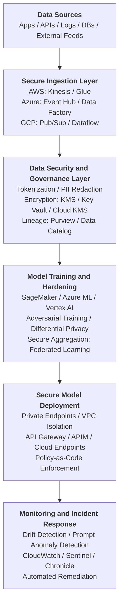
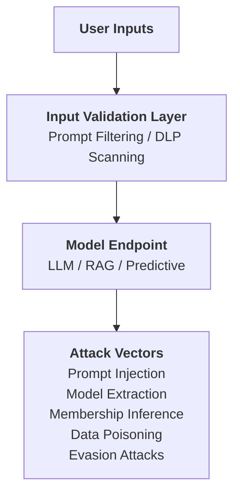
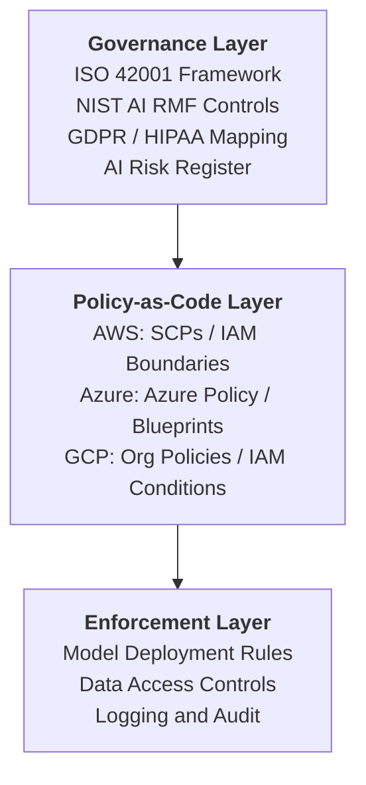

# 📘 EXECUTIVE SUMMARY
## AI/Data Security Architecture Portfolio — Multi‑Cloud (AWS · Azure · GCP)

Organizations are rapidly adopting AI to accelerate innovation, automate decision‑making, and unlock new business value. This shift introduces a new class of risks: *adversarial attacks*, *data poisoning*, *insecure model deployments*, *governance gaps*, and *AI‑specific incident response challenges*. Enterprises need leaders who can secure AI systems end‑to‑end — from data pipelines to model deployment to governance and monitoring.

This portfolio demonstrates my ability to design, implement, and operationalize secure, compliant, and resilient AI ecosystems across AWS, Azure, and GCP. It includes hands‑on labs, multi‑cloud reference architectures, governance frameworks, adversarial testing environments, and real‑time monitoring solutions.

[Link to full 12-week walkthrough](https://github.com/epatter1/AI_Data_Security_Architect_Program/blob/main/12_week_overview.md) of building an AI/Data Security Program

## Across five modules, this portfolio showcases:

### 1. AI Threat Modeling & Adversarial Testing
Practical demonstrations of evasion, poisoning, extraction, inversion, and membership inference attacks across cloud platforms. Includes MITRE ATLAS mappings and risk scoring frameworks.

### 2. AI Model Defense & Hardening
Implementation of adversarial training, differential privacy, input validation, and robustness evaluation pipelines. Demonstrates measurable improvements in model resilience.

### 3. Secure AI Data Pipelines & Training Environments
Multi‑cloud architectures for secure ingestion, encryption, lineage tracking, federated learning, and poisoning detection.

### 4. AI Governance & Compliance
ISO 42001‑aligned governance frameworks, NIST AI RMF mappings, GDPR/HIPAA compliance matrices, and policy‑as‑code enforcement across AWS, Azure, and GCP.

### 5. AI Monitoring, Detection & Incident Response
Real‑time drift detection, anomaly detection, automated remediation workflows, and full AI breach simulations.

This portfolio reflects the capabilities required of a Senior AI Security Architect, AI Governance Leader, or Principal Security Engineer — combining deep technical execution with governance, compliance, and executive‑level communication.

---

## Visual Architecture Diagrams

### Multi-Cloud Secure AI Pipeline (High-Level)

---

### AI Threat Modeling and Attack Surface

---

### AI Governance and Compliance Architecture

---

## AI Security & Governance Consulting Services
Helping organizations build secure, compliant, and trustworthy AI systems.

I provide end‑to‑end AI security architecture, governance, and risk management services across AWS, Azure, and GCP. My work helps organizations accelerate AI adoption while maintaining strong security, privacy, and compliance controls.

### Core Service Areas

#### 1. AI Security Architecture & Design
- Secure AI/ML pipeline design
- Multi‑cloud AI architecture (AWS, Azure, GCP)
- Zero‑trust AI deployment patterns
- Encryption, key management, and data protection

#### 2. AI Threat Modeling & Adversarial Testing
- MITRE ATLAS‑aligned threat modeling
- Red teaming for LLMs, RAG systems, and predictive models
- Adversarial attack simulations (evasion, poisoning, extraction)
- AI risk scoring and prioritization

#### 3. Secure AI Data Pipelines & Training Environments
- Secure ingestion and data governance
- Federated learning security
- Data poisoning detection
- Model integrity validation

#### 4. AI Governance, Compliance & Responsible AI
- ISO 42001 and NIST AI RMF implementation
- GDPR/HIPAA compliance for AI systems
- AI use case intake workflows
- Policy‑as‑code enforcement

#### 5. AI Monitoring, Detection & Incident Response
- Real‑time drift and anomaly detection
- AI‑specific incident response playbooks
- Automated remediation workflows
- AI breach simulation exercises

---

### Engagement Models
- **Advisory & Architecture** — Strategic guidance on AI security design and roadmap planning.
- **Assessment & Audit** — Security assessments, compliance reviews, and red team exercises.
- **Ongoing AI Security Operations** — Continuous monitoring, incident response, and governance updates.

---

### Why Clients Choose This Approach
- Multi‑cloud expertise
- Deep security engineering background
- Executive‑ready communication
- Hands‑on implementation capability
- Proven frameworks and reusable assets
